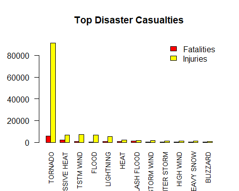
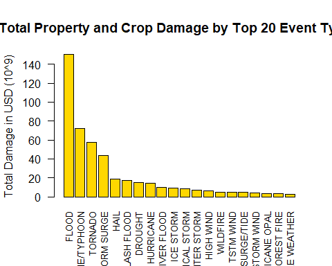

## Sypnosis

This paper seeks to address the following questions based on the U.S. National Oceanic and Atmospheric Administration’s (NOAA) storm database covering the period between 1950 and end in November 2011:

* Across the United States, which types of events (as indicated in the 𝙴𝚅𝚃𝚈𝙿𝙴 variable) are most harmful with respect to population health?
Across the United States, which types of events have the greatest economic consequences?

* Impacts on population health are represented within the data as injuries and fatalities and the are discussed separately below.

The economic impact is represented by the dual impacts of Crop and Property damage - these will be considered together to give an overall picture of economic impact.

## Loading of Dataset & Required Libraries


```r
library(ggplot2)
```

```
## Warning: package 'ggplot2' was built under R version 3.4.4
```

```r
library(tidyr)
```

```
## Warning: package 'tidyr' was built under R version 3.4.4
```

```r
library(dplyr)
```

```
## Warning: package 'dplyr' was built under R version 3.4.4
```

```r
FileDownloadLocation = "https://d396qusza40orc.cloudfront.net/"
File = "repdata%2Fdata%2FStormData.csv.bz2"

if(all(File %in% dir()) == FALSE) { 
        
        download.file(paste0(FileDownloadLocation, File), 
                       File, method = "curl")
} 
## set the number of rows to read in equal to the number of obs found in
## exploratory analysis to improve data load performance
storm_data <- read.table(File,  header = TRUE, sep = ",", nrows = 902298 )
dim(storm_data)
```

```
## [1] 902297     37
```
Relevant columns are selected

```r
storm_data <- storm_data[ , c(8, 23:28)] 
rm(storm_data_file)
```

```
## Warning in rm(storm_data_file): object 'storm_data_file' not found
```

```r
head(storm_data)
```

```
##    EVTYPE FATALITIES INJURIES PROPDMG PROPDMGEXP CROPDMG CROPDMGEXP
## 1 TORNADO          0       15    25.0          K       0           
## 2 TORNADO          0        0     2.5          K       0           
## 3 TORNADO          0        2    25.0          K       0           
## 4 TORNADO          0        2     2.5          K       0           
## 5 TORNADO          0        2     2.5          K       0           
## 6 TORNADO          0        6     2.5          K       0
```

```r
total_injuries <- aggregate(INJURIES~EVTYPE, storm_data, sum)
total_injuries <- arrange(total_injuries, desc(INJURIES))
```

```
## Warning: package 'bindrcpp' was built under R version 3.4.4
```

```r
total_injuries <- total_injuries[1:20, ]
total_injuries
```

```
##                EVTYPE INJURIES
## 1             TORNADO    91346
## 2           TSTM WIND     6957
## 3               FLOOD     6789
## 4      EXCESSIVE HEAT     6525
## 5           LIGHTNING     5230
## 6                HEAT     2100
## 7           ICE STORM     1975
## 8         FLASH FLOOD     1777
## 9   THUNDERSTORM WIND     1488
## 10               HAIL     1361
## 11       WINTER STORM     1321
## 12  HURRICANE/TYPHOON     1275
## 13          HIGH WIND     1137
## 14         HEAVY SNOW     1021
## 15           WILDFIRE      911
## 16 THUNDERSTORM WINDS      908
## 17           BLIZZARD      805
## 18                FOG      734
## 19   WILD/FOREST FIRE      545
## 20         DUST STORM      440
```

```r
total_fatalities <- aggregate(FATALITIES~EVTYPE, storm_data, sum)
total_fatalities <- arrange(total_fatalities, desc(FATALITIES))
total_fatalities <- total_fatalities[1:20, ]
total_fatalities
```

```
##                     EVTYPE FATALITIES
## 1                  TORNADO       5633
## 2           EXCESSIVE HEAT       1903
## 3              FLASH FLOOD        978
## 4                     HEAT        937
## 5                LIGHTNING        816
## 6                TSTM WIND        504
## 7                    FLOOD        470
## 8              RIP CURRENT        368
## 9                HIGH WIND        248
## 10               AVALANCHE        224
## 11            WINTER STORM        206
## 12            RIP CURRENTS        204
## 13               HEAT WAVE        172
## 14            EXTREME COLD        160
## 15       THUNDERSTORM WIND        133
## 16              HEAVY SNOW        127
## 17 EXTREME COLD/WIND CHILL        125
## 18             STRONG WIND        103
## 19                BLIZZARD        101
## 20               HIGH SURF        101
```

```r
totals<- merge(total_fatalities, total_injuries, by.x = "EVTYPE", by.y = "EVTYPE")
totals<-arrange(totals,desc(FATALITIES+INJURIES))
names_events <- totals$EVTYPE
```
Data is now cleaned and ready for graph plotting.

## Results

### Across the United States, which types of events (as indicated in the EVTYPE variable) are most harmful with respect to population health?

Fatalities and Injuries are Merged


```r
barplot(t(totals[,-1]), names.arg = names_events, ylim = c(0,95000), beside = T, cex.names = 0.8, las=2, col = c("red", "yellow"), main="Top Disaster Casualties")
legend("topright",c("Fatalities","Injuries"),fill=c("red","yellow"),bty = "n")
```

<!-- -->
Based on the above histogram, it can be observed that *Tornado* and *Heat* had caused the most number of fatalities and *Tornado* had caused most injuries in the United States between the period of 1995 to 2011.

## Across the United States, which types of events have the greatest economic consequences?

### Data Processing
We need to convert property and cropt damage into numbers where H=10^2, K=10^3, M =10^6, and B=10^9. For this, we create two new variables: PROPDAMAGE, CROPDAMAGE


```r
storm_data$PROPDAMAGE = 0
storm_data[storm_data$PROPDMGEXP == "H", ]$PROPDAMAGE = storm_data[storm_data$PROPDMGEXP == "H", ]$PROPDMG * 10^2
storm_data[storm_data$PROPDMGEXP == "K", ]$PROPDAMAGE = storm_data[storm_data$PROPDMGEXP == "K", ]$PROPDMG * 10^3
storm_data[storm_data$PROPDMGEXP == "M", ]$PROPDAMAGE = storm_data[storm_data$PROPDMGEXP == "M", ]$PROPDMG * 10^6
storm_data[storm_data$PROPDMGEXP == "B", ]$PROPDAMAGE = storm_data[storm_data$PROPDMGEXP == "B", ]$PROPDMG * 10^9

storm_data$CROPDAMAGE = 0
storm_data[storm_data$CROPDMGEXP == "H", ]$CROPDAMAGE = storm_data[storm_data$CROPDMGEXP == "H", ]$CROPDMG * 10^2
storm_data[storm_data$CROPDMGEXP == "K", ]$CROPDAMAGE = storm_data[storm_data$CROPDMGEXP == "K", ]$CROPDMG * 10^3
storm_data[storm_data$CROPDMGEXP == "M", ]$CROPDAMAGE = storm_data[storm_data$CROPDMGEXP == "M", ]$CROPDMG * 10^6
storm_data[storm_data$CROPDMGEXP == "B", ]$CROPDAMAGE = storm_data[storm_data$CROPDMGEXP == "B", ]$CROPDMG * 10^9
```

Aggregate property and crop damage into one variable. Arrange and select the top 20.


```r
economic_damage <- aggregate(PROPDAMAGE + CROPDAMAGE ~ EVTYPE, storm_data, sum)
names(economic_damage) = c("EVENT_TYPE", "TOTAL_DAMAGE")
economic_damage <- arrange(economic_damage, desc(TOTAL_DAMAGE))
economic_damage <- economic_damage[1:20, ]
economic_damage$TOTAL_DAMAGE <- economic_damage$TOTAL_DAMAGE/10^9
economic_damage$EVENT_TYPE <- factor(economic_damage$EVENT_TYPE, levels = economic_damage$EVENT_TYPE)
head(economic_damage)
```

```
##          EVENT_TYPE TOTAL_DAMAGE
## 1             FLOOD    150.31968
## 2 HURRICANE/TYPHOON     71.91371
## 3           TORNADO     57.34061
## 4       STORM SURGE     43.32354
## 5              HAIL     18.75290
## 6       FLASH FLOOD     17.56213
```

### Results

Graph showing cost of damages from severe weather events


```r
with(economic_damage, barplot(TOTAL_DAMAGE, names.arg = EVENT_TYPE, beside = T, cex.names = 0.8, las=2, col = "gold", main = "Total Property and Crop Damage by Top 20 Event Types", ylab = "Total Damage in USD (10^9)"))
```

<!-- -->
